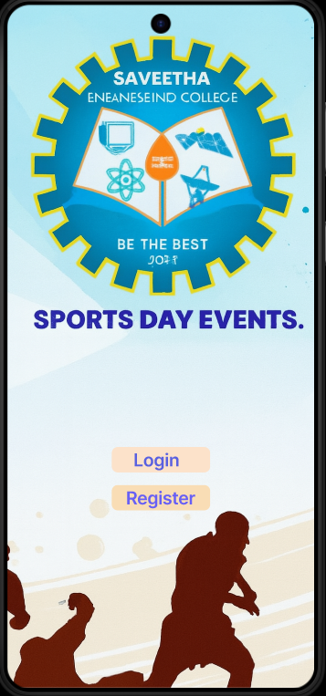
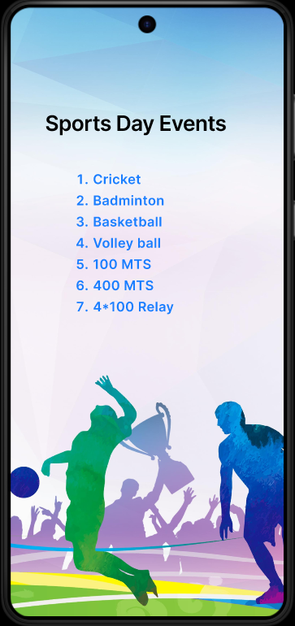
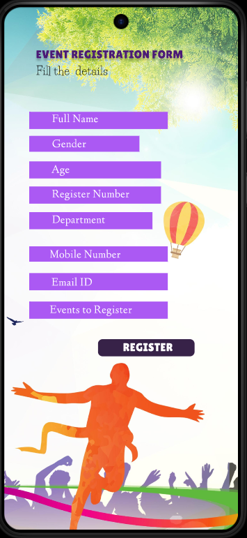
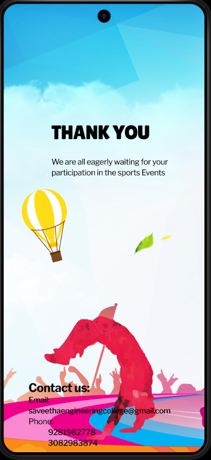

# Ex09 Event Registration Web Application
# Date:07.10.2025
# AIM:
To design, develop and deploy a web application for event registration.

# DESIGN STEPS:
## Step 1:
Create a new frame.

## Step 2:
Select any one preset size of your choice.

## Step 3:
Select the shapes you need.

## Step 4:
Import images as needed.

## Step 5:
Create pages based on your need and link them.

## Step 6:
Validate the HTML and CSS code.

## Step 6:
Publish the website in the given URL.

# DESIGN TOOL:
Figma

# CODE:
~~~
page 1:

  
  

  
Login

  

  
Register

page 2:

  
  
Sports Day Events

  
Cricket Badminton Basketball Volley ball 100 MTS 400 MTS 4*100 Relay

page 3:

  
  
EVENT REGISTRATION FORM

  
Fill the  details

  

  

  

  

  

  

  

  

  

  
Full Name

  
Age

  
Register Number

  
Gender

  
Department

  
Email ID

  
Mobile Number

  
Events to Register

  
REGISTER

page 4:

  
  
THANK YOU

  
We are all eagerly waiting for your participation in the sports Events

  
Contact us: Email:                                                                                     saveethaengineeringcollege@gmail.com Phone:              9281982778              3082983874

~~~
# OUTPUT:

# RESULT:
The program to design, develop and deploy a web application for event registration is completed successfully.
